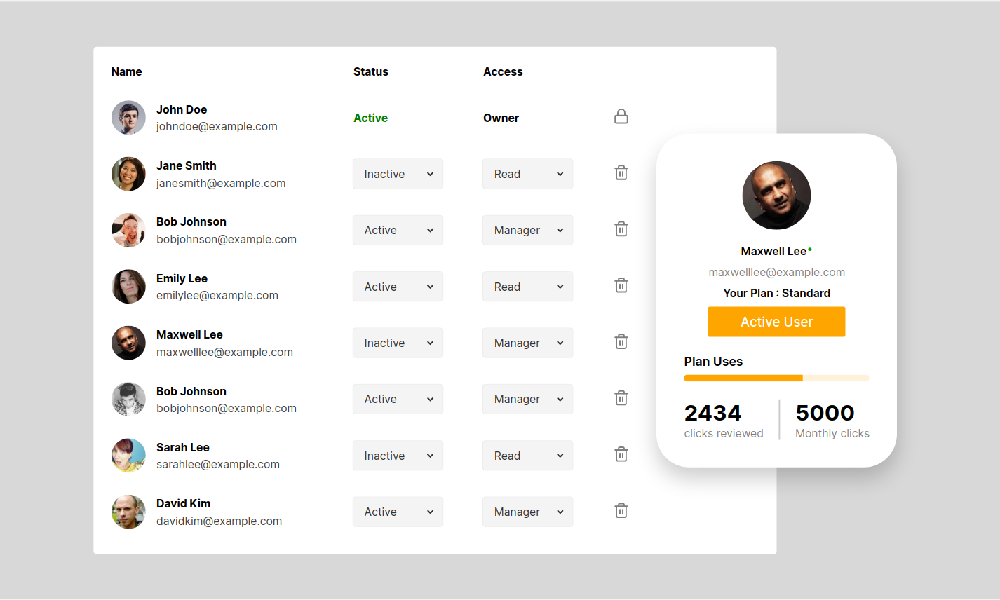

# User-List-React-App (Part-1 : UI)

This is a React application that displays a list of users on the left side and shows the details of a user on the right side when hovered over. The details of the user are displayed in a card format. The user list on the left side is populated with static dummy data for now.

- Live Link : https://jade-crumble-2e9bfe.netlify.app/

## Features

- Display a list of users on the left side.
- Show user details on the right side when hovered over.
- Display user details in a card format.
- The first user in the list always has "Active" as status and "Owner" as access with a lock sign icon instead of a dustbin icon.
- Icons for the lock sign and dustbin are added from the `react-feather` package.
- State management is done using Redux Toolkit.

## Getting Started

To get started with the application, follow the steps below:

- Clone the repository.
- Install the dependencies using npm install.
- Start the application using npm run dev.
- Open http://localhost:5173 to view the app in the browser.

## Dependencies

The following dependencies are used in this project:

- react
- react-dom
- react-feather
- @reduxjs/toolkit
- react-redux

## Folder Structure

    .
    ├── index.html
    ├── package.json
    ├── package-lock.json
    ├── public
    │   └── customer.png
    ├── README.md
    ├── src
    │   ├── App.css
    │   ├── App.jsx
    │   ├── assets
            └── snapshot.png
    │   ├── components
    │   │   ├── Profile
    │   │   │   ├── Profile.jsx
    │   │   │   └── Profile.module.css
    │   │   ├── User
    │   │   │   ├── User.jsx
    │   │   │   └── User.module.css
    │   │   ├── User Card
    │   │   │   ├── UserCard.jsx
    │   │   │   └── UserCard.module.css
    │   │   └── User List
    │   │       ├── UserList.jsx
    │   │       └── UserList.module.css
    │   ├── data
    │   │   └── dummyUser.js
    │   ├── main.jsx
    │   └── store
    │       ├── CardSlice.js
    │       ├── HoverSlice.js
    │       └── index.js
    └── vite.config.js

## Snapshot

